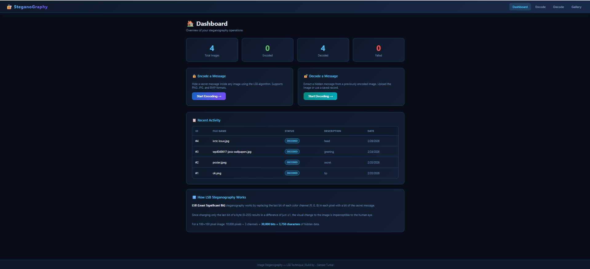
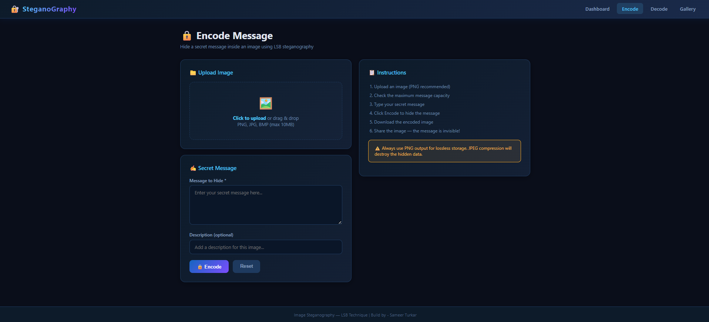
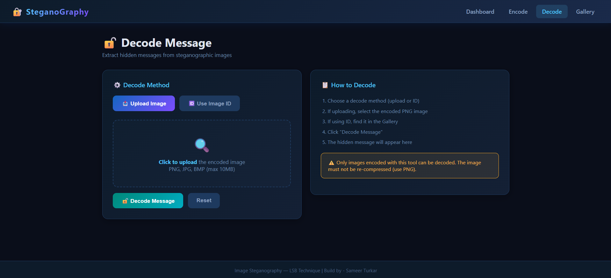

# Image Steganography Web App

A simple, clean web application that allows users to **hide secret text inside images** and later **extract it back**. This project focuses on usability, clarity, and a practical demonstration of steganography using modern web technologies.

---

## Live Demo

https://image-steganography-rose.vercel.app/

---

## About the Project

This project demonstrates **LSB (Least Significant Bit) steganography** in a user-friendly way. Users can upload an image, enter a secret message, and generate a new image that visually looks the same but contains hidden data.

The decoding feature allows users to upload a stego-image and retrieve the hidden message instantly.

---

## Features

- Encode secret messages into images
- Decode hidden messages from images
- Clean and minimal UI for better user experience
- Image preview before and after processing
- Download encoded (stego) image
- Fast and lightweight processing

---

## Screenshots

> Add your screenshots inside an `assets/` folder in your repo

```md



```

**Tip:** Use clear screenshots showing:
- Upload image section
- Message input field
- Result/output preview

---

## Tech Stack

**Frontend**
- React.js
- HTML5, CSS3
- JavaScript

**Backend**
- Java
- Spring boot
- SQL

**Other**
- Axios (API calls)
- Image processing logic (LSB technique)

---

## How It Works

### Encoding Process
1. User uploads an image
2. Enters a secret message
3. Message is converted into binary
4. Binary data is embedded into image pixels (LSB)
5. New image is generated and available for download

### Decoding Process
1. User uploads encoded image
2. System reads pixel data
3. Extracts hidden binary data
4. Converts it back to original message

---

## Use Cases

- Learning steganography concepts
- Data hiding demonstrations
- Academic mini-projects
- Experimenting with image processing

---

## Limitations

- Large messages may not fit in small images
- Not secure without encryption
- Image compression may destroy hidden data (especially JPEG)

---

## Future Improvements

- Add encryption (AES) before encoding
- Drag and drop image upload
- Support for more file formats
- Progress indicators and better UX
- Mobile responsiveness improvements

---

## Contributing

Contributions are welcome.

1. Fork the repository
2. Create a new branch
3. Make your changes
4. Submit a pull request

---

## Author

Sameer Turkar

---

## License

This project is open source and available under the MIT License.

---

## Final Note

This project focuses on simplicity and clarity while demonstrating a powerful concept. It is a good mix of frontend, backend, and algorithmic thinking in one application.

